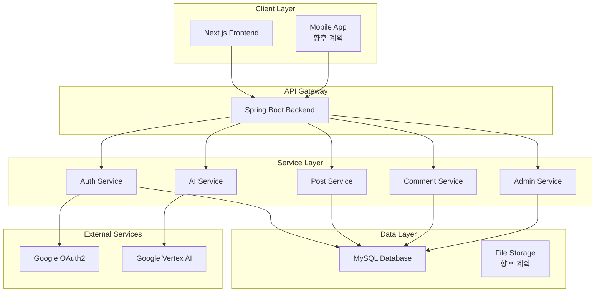
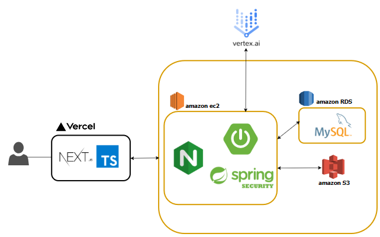

# 구절구절 - Verse by Verse 📝✨

> AI가 당신의 일상을 문학으로 변환해주는 소셜 플랫폼

[](https://github.com/your-repo/verse-by-verse)
[](https://openjdk.java.net/projects/jdk/21/)
[](https://spring.io/projects/spring-boot)
[](LICENSE)

---

## 목차

## 팀원 소개

> **TEAM verseByVerse**

|     팀원     |                                                   강소연                                                    |                                                   박민석                                                   |                                                   이상준                                                    |                                                   황한나                                                   |
|:----------:|:--------------------------------------------------------------------------------------------------------:|:-------------------------------------------------------------------------------------------------------:|:--------------------------------------------------------------------------------------------------------:|:-------------------------------------------------------------------------------------------------------:|
|    프로필     |  |  |  |  |
|   GitHub   |                                  [@wosyh18](https://github.com/wosyh18)                                  |                               [@qkralstjr](https://github.com/qkralstjr)                                |                                 [@prac2317](https://github.com/prac2317)                                 |                              [@Sooamazing](https://github.com/Sooamazing)                               |
| **주요 담당**  |                                             게시물 관리, 반응하기 기능                                              |                                       Vertex AI 연동, 신고 처리, 욕설 감지                                        |                                          소셜 로그인, 회원 프로필, 성취 배지                                           |                                  AI 첨삭 미리보기, 댓글, 랭킹 시스템 설계, 프로젝트 공통 설정                                  |
| **세부 기능**  |                                         게시물 관리 시스템 구축, 반응 기능 구현                                          |                                        AI 프롬프트 엔지니어링, 신고 시스템 설계                                         |                                         OAuth2 인증 시스템, 배지 시스템 설계                                         |                                미리보기 세션 관리, 3 계층 댓글, 일/주/월별 랭킹 자동 집계 시스템                                 |
| **기술적 기여** |                               **CI/CD, AWS 인프라 구축**<br/>EC2, RDS, S3 환경 구성                               |                                  **S3 이미지 업로드 시스템**<br/>파일 업로드 및 관리 구현                                  |                                  **인증 및 보안 시스템**<br/>OAuth2, JWT 토큰 관리                                   |                               랭킹 점수 집계 스케줄링, **공통 응답 및 예외 체계 프로젝트 초기 설정**                               |
|   **공통**   |                         **프로젝트 관리 및 문서화**<br/>JavaDoc, Notion, GitHub Issues 활용                          |                                **테스트 자동화 및 품질 보증**<br/>JUnit, Mockito 활용                                |                             **RESTful API 문서화 및 관리**<br/>Notion, Postman 활용                              |                     **코드 리뷰 및 품질 관리**<br/>GitHub Pull Request, Code Review 프로세스 활용                      |

## 📋 서비스 개요

### 🎯 서비스 소개 및 목적

**Verse by Verse**는 사용자가 작성한 일상의 글을 AI가 문학적으로 다듬어주는 혁신적인 소셜 플랫폼입니다.

**개발 기간**: 2025년 6월 ~ 2025년 8월 (3개월, 스프린트 3주 단위)

### 💡 어떤 문제를 해결할 수 있는가?

1. **표현력의 한계**: "짜증나", "기뻐", "슬퍼" 같은 단조로운 감정 표현을 풍부하게 변환
2. **글쓰기 실력 향상**: AI 첨삭을 통해 자연스럽게 어휘력과 표현력 향상
3. **창작 동기 부여**: 내 글이 문학작품으로 변화하는 재미와 성취감 제공
4. **소통의 질 개선**: SNS, 블로그에서 더 매력적이고 감각적인 글쓰기 가능
5. **학습 효과**: 수능, 논술, 글쓰기 실력에 직접적인 도움

### 👥 어떤 사람들이 이 프로젝트를 사용하면 좋은가?

**🎓 학습자 & 수험생**

- 수능, 논술, 글쓰기 실력 향상이 필요한 학생들
- 감정을 다양하게 표현하는 어휘력 확장을 원하는 사람들
- 문학 작품 연계로 국어 성적 향상을 목표로 하는 학습자들

**💼 직장인 & 전문가**

- 업무, 소통에서 전문성을 보여주고 싶은 직장인들
- 기획서, 보고서 작성 시 표현력 향상이 필요한 사람들
- 개인 브랜딩을 위한 글쓰기 실력을 키우고 싶은 전문가들

**✨ 세련된 표현을 원하는 사람들**

- SNS, 일상 대화에서 매력적으로 소통하고 싶은 사람들
- 인스타그램, 블로그 게시글을 더 감각적으로 작성하고 싶은 사용자들
- "글 정말 잘 쓰네요" 칭찬을 받고 싶은 모든 사람들

**📝 글쓰기 연습을 원하는 사람들**

- 체계적인 피드백으로 글쓰기 실력을 늘리고 싶은 사람들
- 매일 부담 없이 글쓰기 연습을 하고 싶은 사람들
- 실제 활용 가능한 실용적 표현을 학습하고 싶은 사람들

### ⚙️ 이 프로젝트는 어떻게 작동하는가?

**Verse by Verse**는 다음과 같은 과정으로 당신의 일상을 문학으로 변환합니다:

```mermaid
graph LR
    A[일상 표현 입력<br/>"진짜 짜증나"] --> B[감정 인식<br/>😤 분노]
    B --> C[AI 프리즘 변환<br/>목적별 스타일 적용]
    C --> D[문학적 결과물<br/>"마음이 무거운 구름에<br/>가려진 듯하다"]
    D --> E[점수 제공<br/>실시간 평가]
    E --> F[소셜 공유<br/>커뮤니티 반응]
```

**🎯 핵심 변환 예시**:

- **변환 전**: "오늘 진짜 짜증났어. 모든 게 다 싫다."
- **변환 후**: "오늘 마음이 무거운 구름에 가려진 듯하다. 모든 것이 잿빛으로 물들어 보인다."

**✨ 특별한 기능들**:

1. **목적별 AI 첨삭**: 학술용, 전문가용, SNS용으로 각각 다른 톤앤매너
2. **실시간 점수 시스템**: 작문 실력, 창의성, 감정 표현도 점수 제공
3. **랭킹 & 소셜**: 다른 사용자들과 점수 비교 및 동기부여
4. **SNS 공유**: 첨삭된 글을 바로 인스타, 블로그에 활용 가능

---

## 🆚 경쟁자 분석 ("X vs Y")

### 주요 경쟁 서비스 비교

| 기능             | 구절구절    | 브런치 | 네이버 블로그 | ChatGPT  | 맞춤법검사기 |
|----------------|---------|-----|---------|----------|--------|
| **AI 문학 변환**   | ✅ 전용 기능 | ❌   | ❌       | 🔶 수동 요청 | ❌      |
| **감정 기반 첨삭**   | ✅       | ❌   | ❌       | ❌        | ❌      |
| **목적별 스타일 제공** | ✅ 3가지   | ❌   | ❌       | 🔶 수동    | ❌      |
| **실시간 점수 시스템** | ✅       | ❌   | ❌       | ❌        | 🔶 기본적 |
| **소셜 & 랭킹 기능** | ✅       | ✅   | 🔶 제한적  | ❌        | ❌      |
| **즉시 활용 가능**   | ✅ 원클릭   | ❌   | ❌       | 🔶 복사 필요 | 🔶 수정만 |
| **학습 효과**      | ✅ 체계적   | 🔶  | ❌       | 🔶       | 🔶 기본적 |
| **한국어 감정 특화**  | ✅       | 🔶  | ✅       | 🔶       | ✅      |
| **무료 사용**      | ✅ 베타    | ✅   | ✅       | 🔶 제한적   | ✅      |

### 🎯 왜 Verse by Verse를 선택해야 하는가?

1. **전용 AI 프리즘 엔진**: 문학 변환에 특화된 AI 프롬프트 엔지니어링으로 정확한 감정 변환
2. **원클릭 변환**: 복잡한 설정 없이 즉시 "짜증나"를 "무지개빛 문학"으로 변환
3. **목적별 맞춤 첨삭**: 학술용, 전문가용, SNS용 각각 다른 스타일 제공
4. **실시간 성장 확인**: AI 점수로 객관적인 글쓰기 실력 향상 추적
5. **즉시 활용 가능**: 첨삭된 글을 바로 SNS, 블로그, 과제 등에 활용
6. **재미있는 학습**: 딱딱한 공부가 아닌 놀이하듯 글쓰기 실력 향상

---

## 🖥️ 서비스 화면 구성

### 주요 화면 및 기능

#### 1. 🏠 메인 랜딩 페이지

- **프리즘 컨셉 소개**: "감정을 프리즘에 통과시켜 무지개빛 문학으로"
- **실제 변환 예시**: "짜증나" → "마음이 무거운 구름에 가려진 듯하다"
- **타겟별 어필**: 학습자, 직장인, 세련된 표현을 원하는 사람들
- **바로 변환해보기 CTA**: 원클릭으로 서비스 체험

#### 2. ✨ AI 첨삭 변환 화면

- **일상 표현 입력**: 자유로운 감정 표현 작성
- **감정 인식**: 😤 분노, 😄 기쁨, 😔 우울, 💕 설렘 등 자동 분류
- **목적별 스타일 선택**: 학술용, 전문가용, SNS용 첨삭 옵션
- **실시간 변환 결과**: 변환 전후 비교 뷰
- **점수 시스템**: 작문 실력, 창의성, 감정 표현도 실시간 평가

#### 3. 📊 점수 및 성장 추적

- **개인 성장 그래프**: 글쓰기 실력 향상 추이
- **세부 점수 분석**: 어휘력, 표현력, 창의성 등 영역별 점수
- **성취 배지**: 다양한 도전과제 완료 시 획득

#### 4. 🏆 랭킹 및 커뮤니티

- **전체 랭킹**: 다른 사용자들과 점수 비교
- **월간/주간 랭킹**: 꾸준한 동기부여를 위한 순위 시스템
- **댓글 & 반응**: 다른 사용자들과 소통 및 피드백

#### 5. 📱 SNS 공유 및 활용

- **원클릭 공유**: 첨삭된 글을 인스타그램, 블로그에 즉시 공유
- **공유 통계**: 좋아요, 댓글 수 등 반응 확인

#### 6. 🛠️ 관리자 기능

- **신고 관리 시스템**: 부적절한 콘텐츠 신고 및 처리
- **욕설 필터**: 자동 욕설 감지 및 차단
- **사용자 통계**: 서비스 사용 현황 및 분석

#### 배지 시스템

- **배지 시스템**: 반응하기 횟수, 게시글 수, 댓글 수 등이 특정 조건을 만족할 때 배지를 발급합니다.
- **비동기 처리**: 중요한 기능(회원가입, 게시글 작성 등)과 부수적인 기능(배지 발급)을 구분하여 처리할 수 있도록 배지는 비동기(@Async 활용)적으로 발급하며,
  각 로직은 별도의 트랜잭션에서 실행됩니다.
- **이벤트 기반**: @EventListener를 활용하여 핵심 비즈니스 로직과 배지 발급 로직을 구분합니다.

#### 회원 관리 및 프로필 기능

- **회원 정보 관리**: 마이페이지에서 자신의 프로필 정보를 수정하고, 계정을 관리(회원 탈퇴)할 수 있습니다.
- **프로필 조회**: 다른 회원의 프로필을 방문하여 작성한 게시글 등 활동 내역을 모아볼 수 있습니다,
- **소셜 연동 관리**: 회원 탈퇴 시, 서비스와 연결된 소셜 계정의 연동을 안전하게 해제합니다.

#### 인증 / 인가

- **로그인**: 소셜 로그인을 구현하여 별도의 회원가입이나 로그인 과정 없이 카카오, 구글 계정을 통해 로그인합니다.
- **세션 기반**:  서버는 세션 기반으로 사용자의 로그인 상태를 관리합니다.
- Spring Security를 사용하여 필터 기반으로, 소셜 로그인은 OAuth2를 기반으로 구현되었습니다.

---

## 🚀 프로젝트 시작하기

### 📋 전제조건

- **Java 21** 이상
- **Docker & Docker Compose**
- **MySQL 8.0**
- **Google Cloud Platform** 계정 (Vertex AI 사용)

### 🔧 설치 및 실행

#### 1. 프로젝트 클론

```bash
git clone https://github.com/your-repo/verse-by-verse.git
cd verse-by-verse
```

#### 2. 환경 변수 설정

```bash
# Backend 환경 변수 (.env)
cp versebyverse-backend/.env.example versebyverse-backend/.env

# 필수 환경 변수 설정
DB_NAME=versebyverse
DB_USERNAME=your_username
DB_PASSWORD=your_password
GOOGLE_CLIENT_ID=your_google_client_id
GOOGLE_CLIENT_SECRET=your_google_client_secret
VERTEX_AI_PROJECT_ID=your_gcp_project_id
```

#### 3. 데이터베이스 실행

```bash
cd versebyverse-backend
docker-compose up -d mysql
```

#### 4. 백엔드 실행

```bash
cd versebyverse-backend
./gradlew bootRun
```

#### 5. 접속 확인

- **Frontend**: http://localhost:3000
- **Backend API**: http://localhost:8080

### 🧪 테스트 실행

```bash
# 백엔드 테스트
cd versebyverse-backend
./gradlew test
```

## 🛠️ 기술 개요 및 구현 상세

### 📚 기술 스택

#### Backend

   

  

  

#### Infrastructure & DevOps

  

#### Code Quality & Testing

  

#### Authentication & Cloud Services

 

### 🏗️ 시스템 아키텍처



### 📊 ERD (Entity Relationship Diagram)


### API 설계

[API 설계](https://www.notion.so/hannanana/API-20d33717f91380739342c33da2c7b92e?source=copy_link)

### 🔄 배포 아키텍처



> **배포 아키텍처 개요**: 사용자가 Vercel을 통해 Next.js 프론트엔드에 접근하고, AWS EC2에서 실행되는 Spring Boot 백엔드와 통신합니다. Vertex
> AI를 통한 AI 기능, MySQL 데이터베이스, S3 파일 저장소가 통합된 클라우드 기반 아키텍처입니다.

---

## 📁 파일 구조

### Backend Structure

```
versebyverse-backend/
├── src/main/java/today/sesac/versebyverse/
│   ├── auth/                    # 인증 관련
│   │   ├── controller/
│   │   ├── service/
│   │   └── dto/
│   ├── member/                  # 회원 관리
│   │   ├── entity/
│   │   ├── repository/
│   │   ├── service/
│   │   └── dto/
│   ├── post/                    # 게시물 관리
│   │   ├── entity/
│   │   ├── repository/
│   │   ├── service/
│   │   ├── controller/
│   │   └── dto/
│   ├── comment/                 # 댓글 시스템
│   ├── ai/                      # AI 서비스
│   ├── ranking/                 # 랭킹 시스템
│   ├── report/                  # 신고 시스템
│   ├── profanity/              # 욕설 필터
│   ├── config/                  # 설정 파일
│   └── common/                  # 공통 유틸리티
├── src/main/resources/
│   ├── application.yml
│   ├── application-local.yml
│   ├── application-prod.yml
│   └── data.sql
└── src/test/                    # 테스트 코드
```

---

## 🧪 Testing

### 테스트 전략

- **단위 테스트**: 비즈니스 로직 검증
- **통합 테스트**: API 엔드포인트 테스트
- **E2E 테스트**: 사용자 시나리오 검증

### 테스트 커버리지

- **목표**: 80% 이상 (예정)
- **도구**: JaCoCo, SonarQube

```bash
# 테스트 실행 및 커버리지 리포트 생성
./gradlew test jacocoTestReport

# 커버리지 확인
open build/jacocoHtml/index.html
```

---

## 📏 프로젝트 규칙

### 🔄 Issue Tracking

- **GitHub Issues** 사용
- **라벨 시스템**: `bug`, `feature`, `enhancement`, `documentation`
- **마일스톤**: 스프린트 단위로 관리

### 📝 Commit Convention

**Types:**

|   **Type**   | **설명**                                                                                                |
|:------------:|-------------------------------------------------------------------------------------------------------|
|   **Feat**   | 새로운 기능 추가                                                                                             |
|   **Fix**    | 버그 수정                                                                                                 |
| **Refactor** | 코드 리팩토링                                                                                               |
|   **Test**   | 테스트 코드, 리팩토링 테스트 코드 추가                                                                                |
|  **Chore**   | 코드 포맷팅, 세미콜론 누락, 코드 변경이 없는 경우<br/>파일/폴더 이름 수정하거나 옮기는 작업<br/>파일 삭제<br/>필요한 주석 추가 및 수정<br/>문서 수정<br/>기타 |

**Example:**

```
[#issue]Type(obj): subject # 이슈 번호를 포함한 요약(무엇을(O), 왜(O) 변경했는지를 설명)

body # 선택, 상세 내용 적기 - 어떻게보다(X) 무엇을(O), 왜(O) 변경했는지를 설명

```

### 🌿 Branch 전략 (Git Flow)

```
main                    # 프로덕션 배포
├── develop            # 개발 통합
├── feature/auth       # 기능 개발
├── feature/ai-service # 기능 개발
├── hotfix/critical-bug # 긴급 수정
└── release/v1.0.0     # 릴리즈 준비
```

### 🔍 Code Convention

#### Backend (Java)

- **Google Java Style Guide** 준수
- **Checkstyle** 설정 적용
- **SonarLint** 플러그인 사용

```xml
<!-- checkstyle.xml -->
<module name="Checker">
  <module name="TreeWalker">
    <module name="Indentation">
      <property name="basicOffset" value="4"/>
    </module>
  </module>
</module>
```

#### Frontend (TypeScript)

- **ESLint + Prettier** 설정
- **Airbnb Style Guide** 기반
- **자동 포맷팅** 설정

```json
{
  "extends": [
    "next/core-web-vitals",
    "@typescript-eslint/recommended",
    "prettier"
  ],
  "rules": {
    "prefer-const": "error",
    "no-unused-vars": "error"
  }
}
```

### 📋 Pull Request 규칙

1. **브랜치명**: `feature/기능명` 또는 `fix/버그명`
2. **PR 템플릿** 사용
3. **코드 리뷰** 필수 (최소 1명)
4. **테스트 통과** 확인
5. **충돌 해결** 후 머지

---

## 개발 규칙

### 커밋 컨벤션

커밋 이력을 쉽게 파악할 수 있도록

|   **Type**   | **설명**                                                                                                |
|:------------:|-------------------------------------------------------------------------------------------------------|
|   **Feat**   | 새로운 기능 추가                                                                                             |
|   **Fix**    | 버그 수정                                                                                                 |
| **Refactor** | 코드 리팩토링                                                                                               |
|   **Test**   | 테스트 코드, 리팩토링 테스트 코드 추가                                                                                |
|  **Chore**   | 코드 포맷팅, 세미콜론 누락, 코드 변경이 없는 경우<br/>파일/폴더 이름 수정하거나 옮기는 작업<br/>파일 삭제<br/>필요한 주석 추가 및 수정<br/>문서 수정<br/>기타 |

### 브랜치 전략

프로젝트는 Github-flow를 기반으로 합니다. 각 브랜치의 역할은 다음과 같습니다.

- **develop**: 메인
- **feature**: 이슈 번호 붙입니다

### 코드 리뷰(Pull Request)

모든 코드는 Pull Request를 통해 develop 브랜치에 병합하는 것을 원칙으로 하며, Pull Request 제출 시 코드 리뷰를 통해 코드 품질을 유지합니다.

- **중요도 구분**: 리뷰어는 P1, P2, P3로 리뷰의 중요도를 구분하여 팀원이 구분할 수 있도록 합니다.
- **템플릿**: pr 생성시 요약, 검증 방법, 체크리스트 등을 담은 템플릿(링크)를 사용하여 리뷰어가 변경 내용을 쉽게 이해하도록 합니다.
- **Pull Request 규칙**
    - pr을 생성하기 전 draft를 만들고, 체크리스트에 제시한 pr 조건을 준수했는지 확인 후 오픈합니다
    - 리뷰어는 전체가 자유롭게 -> 시간 관계상 한 명만 리뷰하는 방식으로 변경했습니다.
    - 전체 테스트가 통과해야 머지 가능?

### 코드 스타일 및 코드 품질 관리

- Google Java Style Guide
- Sonarcube
- 기타 컨벤션
    - 페이지네이션 양식 통일
    - dto 네이밍 양식 통일

---

## 팀 규칙

### 협업 도구

- **Slack**: 팀의 주요 소통 채널입니다. 매일 그 날의 스레드를 만들어 대화를 주고 받습니다.
- **Zep**: 데일리 스크럼, 코어 타임 등 실시간 소통이 필요한 경우 Zep에서 소통합니다.
- **Notion**: 팀의 모든 문서를 기록하고 관리합니다. 회의록, 기획서, 팀 규칙, 트러블 슈팅 기록 등을 체계적으로 기록합니다.

### 데일리 스크럼

- 주 3회 온라인(월, 수, 금) 11시, 주 3회 오프라인(화, 목, 토) 만나서 스크럼을 진행합니다.
- 진행 방식
    - **컨디션 점수**: 각자의 컨디션을 1~10점으로 기록해 팀원의 상태를 확인, 서로의 컨디션을 존중하며 업무를 진행합니다.
    - **업무 공유**: 이전까지 한 일과 오늘 해야 할 일을 팀과 공유합니다.
    - **공지**: 팀이 논의해야 할 사항이 있으면 공지에 적고 공유합니다.
    - **기타**: 개인 일정이나 전달 사항이 있을 경우 비고에 적고 공유합니다.

### 집중 시간(코어 타임)

필요할 때 즉각적인 소통이 가능한 환경을 조성하기 위해 집중 시간을 운영합니다.

- **시간**: 월, 수, 금 오후 13시 ~ 18시
- **장소**: Zep에서 온라인으로 실시간 소통

### 프로젝트 관리

- **스프린트**: 3주 단위의 스프린트로, 총 4번의 스프린트를 거쳤습니다
- 모든 작업은 Github Issue를 통해 관리합니다.
- Github project를 사용해 개발 이슈를 추적합니다.

---

## 🚀 배포 및 운영

### 배포 환경

- **개발**: Docker Compose
- **스테이징**: Kubernetes (예정)
- **프로덕션**: AWS ECS (예정)

### CI/CD 파이프라인

```yaml
# .github/workflows/ci.yml
name: CI/CD Pipeline
on:
  push:
    branches: [ main, develop ]
  pull_request:
    branches: [ main ]

jobs:
  test:
    runs-on: ubuntu-latest
    steps:
      - uses: actions/checkout@v3
      - name: Set up JDK 21
        uses: actions/setup-java@v3
        with:
          java-version: "21"
      - name: Run tests
        run: ./gradlew test
```

---

**⭐ 이 프로젝트가 마음에 드신다면 Star를 눌러주세요!**

_마지막 업데이트: 2025년 8월_
